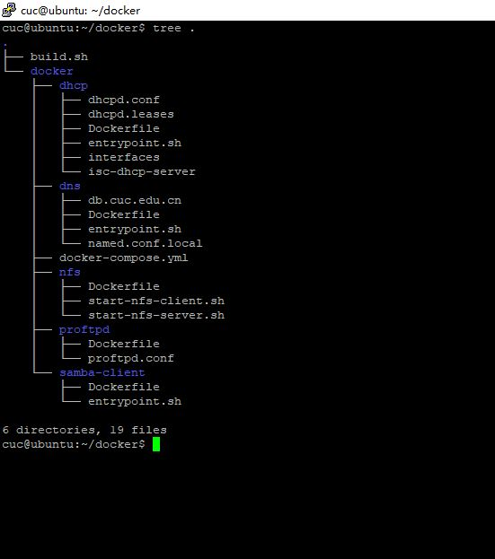
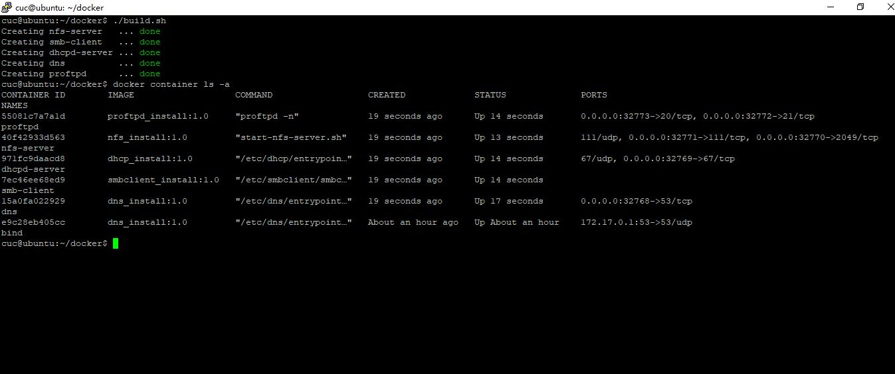
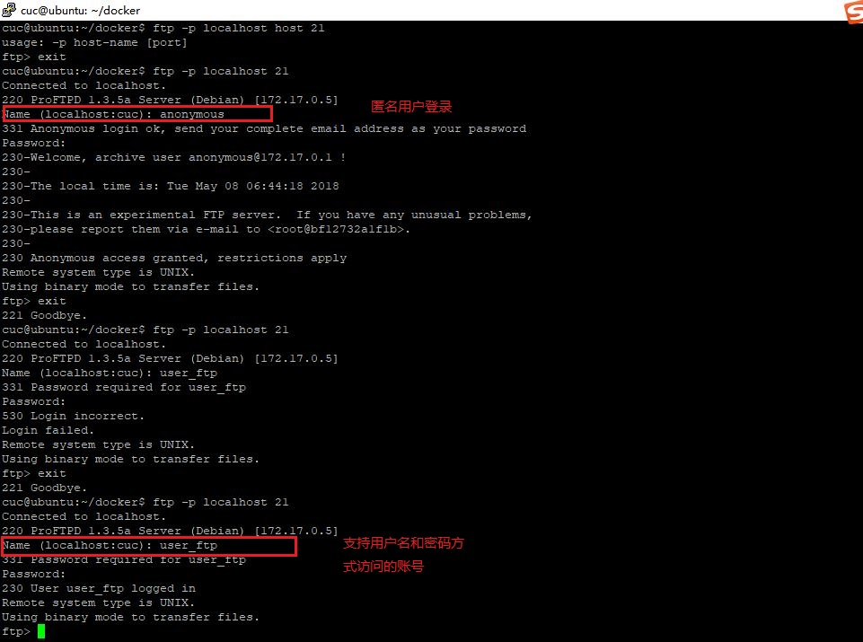
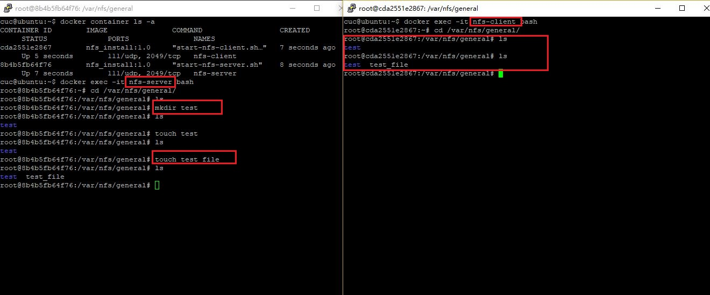
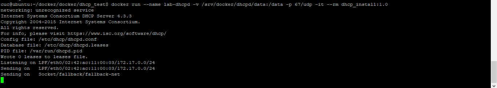
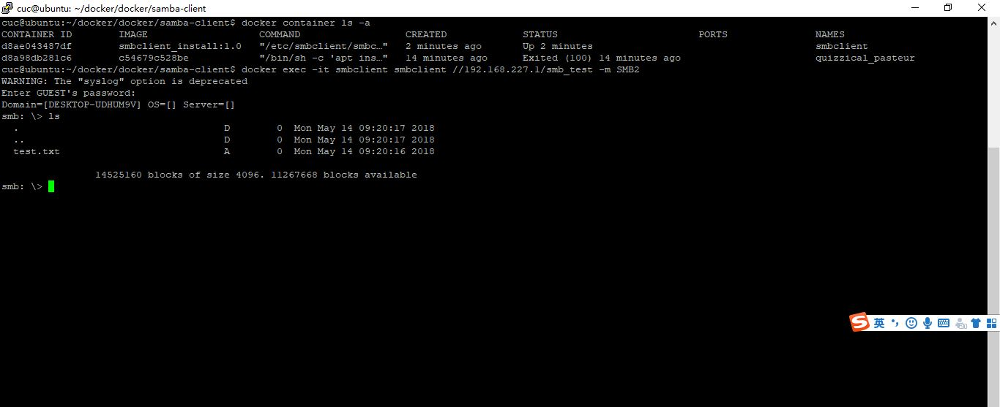

## 第八章：使用容器技术重构FTP、NFS、DHCP、DNS、Samba服务器的自动安装与自动配置

----------

### 一、实验环境

* ubuntu 16.04 server 
* docker：18.03.0-ce
* docker-compose :1.21.0

### 二、目录结构

 

* 直接执行build.sh进行部署
* build.sh 的执行需要 root 权限，普通用户可以 sudo bash build.sh

### 三、实验结果（测试过程为每个image创建后单独测试，run的相关命令已经集合到docker-compose.yml）

* 部署

 

* proftpd

	* `docker run -p 21:21 -p 20:20 proftpd_install:1.0`
	* 测试： `ftp -p localhost 21`

 

* nfs
	
	* server端：`docker run --privileged -d -it --name nfs-server nfs_install:1.0 start-nfs-server.sh`
	* client端：`NFS_SERVER_IP=$(docker inspect --format="{{.NetworkSettings.IPAddress}}" nfs-server)`

    		docker run --privileged -v ~/nfs/var/nfs/general:/var/nfs/general -d --name nfs-client --link nfs-server:nfs-server -e "NFS_SERVER_IP=$NFS_SERVER_IP" -it nfs_install:1.0 start-nfs-client.sh /var/nfs/readonly:/var/nfs/readonly /var/nfs/general:/var/nfs/general
     

 

* DHCP

	* `docker run --name dhcpd-server -p 67/udp -dit --rm dhcp_install:1.0`

	

	

* samba-client

	* `docker run -dt --rm --name smb-client smbclient_install:1.0`
	* 测试命令：`docker exec -it smb-client smbclient //192.168.227.1/smb_test -m SMB2`

 

	

* dns

	* `docker run -d --name=dns --dns=172.17.0.2 --publish=172.17.0.1:53:53/udp dns_install:1.0`
	* 测试命令：`docker exec -it bind dig wp.sec.cuc.edu.cn 172.17.0.1`

 

### 四、遇到的问题

* apt install 包找不到时应先apt update
* 一个容器只运行一个进程
* 镜像层数尽可能少
* ...

### 五、参考资料

* [Docker — 从入门到实践](https://legacy.gitbook.com/book/yeasy/docker_practice/details)
* [c4pr1c3/ac-demo](https://github.com/c4pr1c3/ac-demo)
* [docker制作镜像 apt-get 安装文件报错debconf: unable to initialize frontend: Dialog](https://blog.csdn.net/a19891024/article/details/78250967)
* [Docker Containers for DHCPd Service Isolation](https://hunted.codes/articles/docker-containers-for-dhcpd-service-isolation/)
* [Docker build “Could not resolve 'archive.ubuntu.com'” apt-get fails to install anything](https://stackoverflow.com/questions/24991136/docker-build-could-not-resolve-archive-ubuntu-com-apt-get-fails-to-install-a?utm_medium=organic&utm_source=google_rich_qa&utm_campaign=google_rich_qa)
* [Deploying a DNS Server using Docker](http://www.damagehead.com/blog/2015/04/28/deploying-a-dns-server-using-docker/)