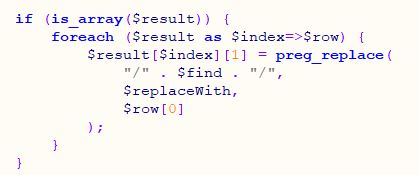
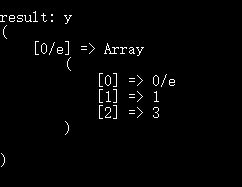
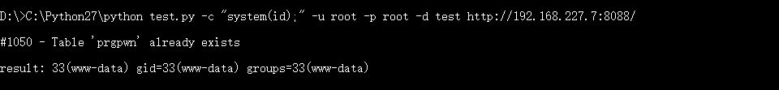
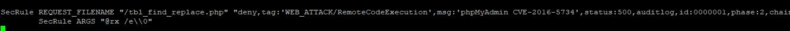
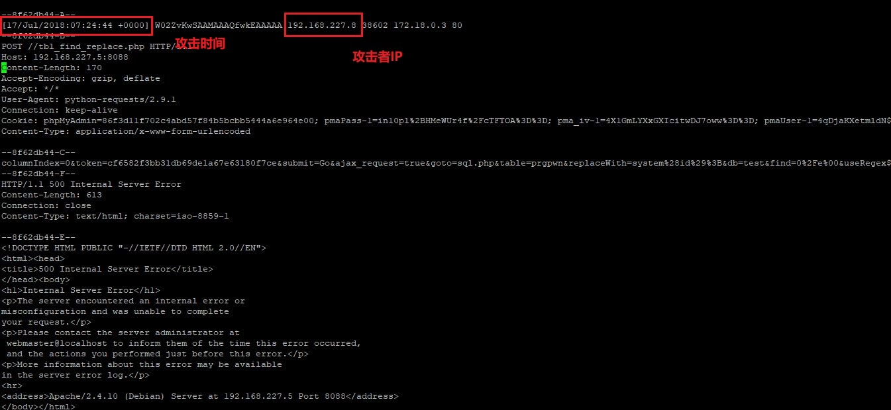
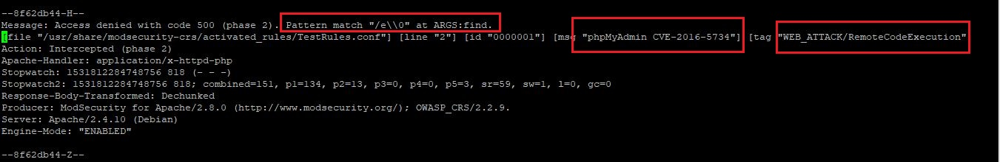
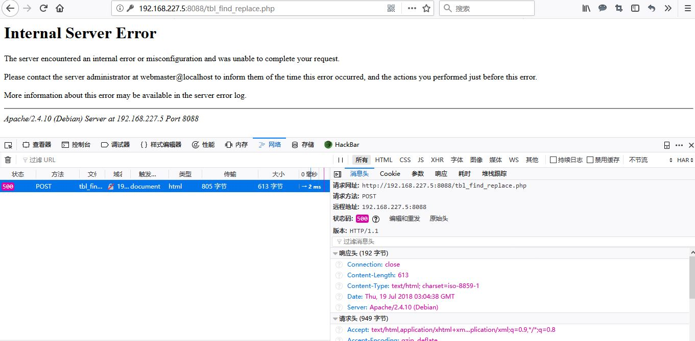
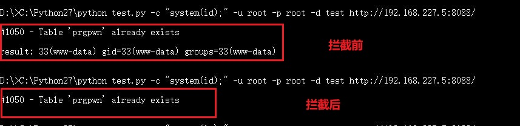
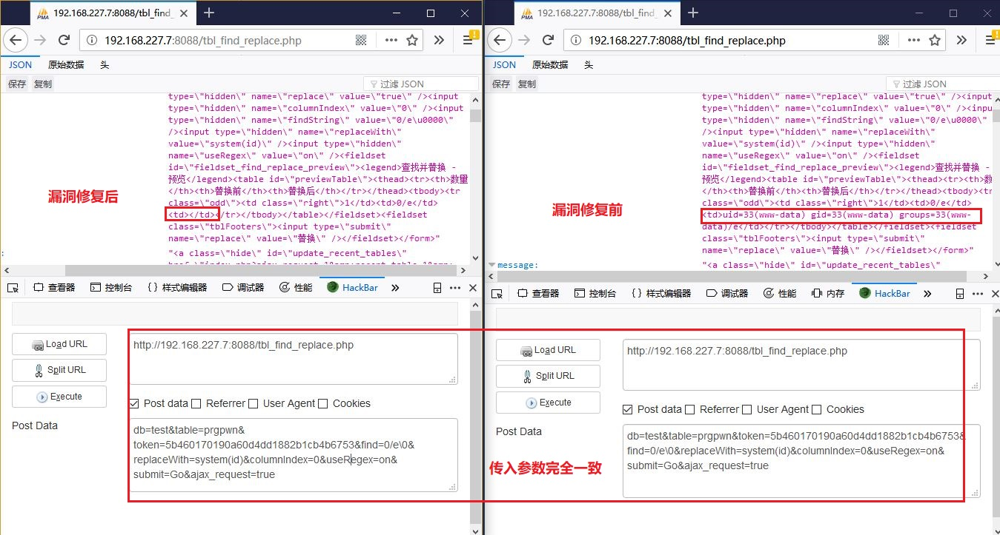

## 漏洞攻防实训 phpMyAdmin 4.0.x—4.6.2 远程代码执行漏洞（CVE-2016-5734）

> write by Bianca

### 一、 漏洞利用原理

* 当要完成查找功能时，利用POST方法提交了待匹配字符串参数和目的字符串参数后，在phpmyadmin（4.3.0-4.6.2）中的执行流程为：

	* tbl_find_replace.php（PMA_TableSearch()—>getReplacePreview（））
	* TableSearch.class.php（getReplacePreview()）
	* TableSearch.class.php（_getRegexReplaceRows()）
		
* 在_getRegexReplaceRows()函数中存在漏洞利用可能的代码如下：

	

	* 解释：result打印结果如下

	

	$result中存放的是先前在数据库中"select"出的待匹配字符串的信息（字符串内容、个数），遍历$result数组，对每个匹配结果调用preg_replace函数。该函数的第一个参数以'e'结尾时，函数会先用第二个参数作为php代码执行后的结果替换给第三个参数（此时只是把结果表中查询出的对应字符串替换，并没有向原数据库中'update'新数据）。phpmyadmin对第一个参数做了一定处理，在正常情况下"/"将作为其结尾字符。
	
* 因此，利用preg_replace()函数的原理，我们构造的漏洞利用参数为：
	
	* 攻击者提交的第一个参数："./e\0"
	* 经phpmyadmin处理后实际第一个参数："/./e\0/"
		
		* 可见，前两个'/'将字符串进行闭合，其后正则模式为e，'\0'作为字符串结束符将之后添加的'/'截断，保证了e为参数末尾，使第二个参数能够执行。
			
	* 攻击者提交的第二个参数：可执行的php代码
	* 攻击者准备的数据库中待替换的字符串：该字符串以/e结尾。

* 漏洞利用结果：返回第二个参数执行后的结果，下图为执行system(id)后的返回结果

	

		

		
### 二、 漏洞缓解 —— 在不给存在漏洞的程序打补丁的前提下，检测并阻止「漏洞利用」行为

* 利用WAF，对post请求的filename及参数进行过滤

	* 什么是WAF？

			
		> WAF（Web Application Firewall）,Web 应用防火墙是通过执行一系列针对 HTTP/HTTPS 的安全策略、工作在应用层来专门为 Web 应用提供保护的一款产品。和传统防火墙相比，它具有基于规则的保护和基于异常的保护以及状态管理等优势。

	* WAF配置

		> 本实验中选用了软件WAF——ModSecurity，将其安装在web服务器上。 

		* 配置方法：https://www.digitalocean.com/community/tutorials/how-to-set-up-mod_security-with-apache-on-debian-ubuntu

	* 具体应用

		* phpmyadmin基于apache服务器运行，开启Apache服务器的mod_security模块，添加自定义规则，凡是带有'e\0'字符的提交数据都拦截，且记录到日志文件中。

			规则位置：/usr/share/modsecurity-crs/activated_rules/TestRules.conf

			

			`SecRule REQUEST_FILENAME "/tbl_find_replace.php" "deny,tag:'WEB_ATTACK/RemoteCodeExecution',msg:'phpMyAdmin CVE-2016-5734',status:500,auditlog,id:0000001,phase:2，chain"
				SecRule ARGS "@rx /e\\0"`

			日志位置：/var/log/apache2/modsec_audit.log

			

			

			拦截效果：

			

			

				
				

	* 通过python对日志文件进行处理，将可疑IP和对应攻击时间放入黑名单（CVE-2016-5734_Black_list.txt）

		* 每次处理后在原日志文件末尾添加"finish here"，下次扫描从改行之后开始，避免重复记录
		* [配置python文件定时执行](https://blog.csdn.net/qq_29980371/article/details/78490367)
		* python源码见：[findBlackList.py](./findBlackList.py)
		

### 三、 漏洞修补
		
> 修改tbl_find_replace.php中的_getRegexReplaceRows()函数源码 

* 将攻击时构造的字符串结束字符'\0'过滤掉，从而在组合参数时（ "/" . $find . "/"）无法使'/e'在末尾，因为字符串读取时无法读取到'\0\'，解决方法为先将其转化为16进制，而后将末尾结束符删除，然后再逆转换为字符串重新赋值给preg_replace第一个参数$find。

			$hex=bin2hex($find);
			if($hex[strlen($hex)-1]==0&&$hex[strlen($hex)-2]==0)
			{
				$new_find="";
				for($i=0;$i<strlen($hex)-2;$i++)
				{
					$new_find.=$hex[$i];
				}
			}
			if($new_find!="")
			{
				$find=Hex2String($new_find);
			}
		
* 为'\0'添加转义字符('\\\\0')，同样可以使字符串结束字符无效

			$hex=bin2hex($find);
	        if($hex[strlen($hex)-1]==0&&$hex[strlen($hex)-2]==0)
	        {
	                $new_find="";
	                for($i=0;$i<strlen($hex)-2;$i++)
	                {
	                        $new_find.=$hex[$i];
	                }
	                $new_find.="5c30";
	        }
	
	        if($new_find!="")
	        {
	                $find=Hex2String($new_find);
	        }

* 使用phpmyadmin 4.6.3中的漏洞修复方法，使字符串无法通过'/./'闭合。以输入'0/e\0'为例，原版本漏洞利用使使用的实际参数为'/0/e'，该版本中将转换为'@0/e'

			if (is_array($result)) {
            $delimiters = array('/', '@', '#', '~', '!', '$', '%', '^', '&', '_');
            $found = false;
            for ($i = 0; $i < count($delimiters); $i++) {
                if (strpos($find, $delimiters[$i]) === false) {
                    $found = true;
                    break;
                }
             }
             if (! $found) {
                return false;
             }
			 
             $find = $delimiters[$i] . $find . $delimiters[$i];
             foreach ($result as $index=>$row) {
                $result[$index][1] = preg_replace(
                        $find,
						$replaceWith,
                        $row[0]
                );
           	 }
        	}

* 修补效果

### 四、 遇到的问题及解决方案

* 问题一： 选取何种方法进行漏洞缓解。
	* 解决方法： 之前考虑过采用nginx+lua+redis的方法，但因为该phpmyadmin的后台为apache服务器，最终决定采用ModSecurity的软件WAF方法对漏洞利用行为进行拦截。

* 问题二：设置mod_security规则时如何多个规则联动。
	* 解决方法：在第一个规则中添加“chain”关键字， chain 相当于多个规则的and操作 ，但只有第一个匹配的规则设定匹配后的操作，该链的其他规则统一采用该操作。

* 问题三：如何在浏览器端测试漏洞防御效果。
	* 解决方法：利用火狐浏览器插件Hackbar，可对指定url构造Post data。

* 问题四：如何重启apache服务时不退出docker容器。
	* 解决方法：使用service apache2 reload命令可达到更新配置文件且不退出容器的效果。

* 问题五：为何在容器中查看apache的error.log、access.log日志为空。
	* 解决方法：日志文件重定向到输出（stdout），可使用docker logs containerid查看。

* 问题六：php中无法读取字符串结束符’\0’，在源码中该如何对其进行过滤。
	* 解决方法：将待匹配字符串转为16进制，可看到’\0’编码后为’00’。

* 问题七：phpmyadmin 4.6.3中的漏洞修复原理。
	* 解决方法：对比之前版本的相应函数代码。

 
### 五、 参考资料：

* [PhpMyAdmin Authorized Rce(CVE-2016-5734)分析](http://www.hackdig.com/08/hack-38691.htm)
* [ModSecurity 中文手册](http://doc.zzbaike.com/b/1/modsecurity-chinese-manual.pdf) 
* [modsecurity配置指令学习](https://www.cnblogs.com/xiachj/p/4112194.html)
* [SpiderLabs/ModSecurity](https://github.com/SpiderLabs/ModSecurity/wiki/Reference-Manual-%28v2.x%29#OWASP_ModSecurity_Core_Rule_Set_CRS_Project)
* [WAF 之 Modsecurity](http://ilingling.cc/2016/06/20/WAF-Modsecurity/)
* [How To Set Up mod_security with Apache on Debian/Ubuntu](https://www.digitalocean.com/community/tutorials/how-to-set-up-mod_security-with-apache-on-debian-ubuntu)
* [preg_replace引发的phpmyadmin(4.3.0-4.6.2)命令执行漏洞](https://www.waitalone.cn/phpmyadmin-preg_replace-rce.html)

